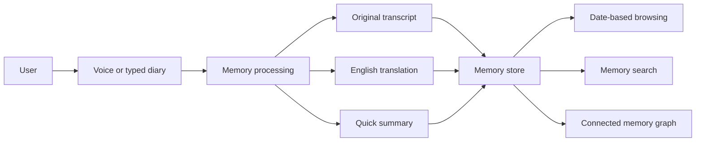

# AHAM — Personal Memory Canvas

AHAM is a personal memory system: a place to capture daily life, turn voice or text into searchable memories, and gradually connect those memories into a useful second brain.

> **Guiding thought:** Don't cheat your own brain. Stay true to yourself.

This GitBook is a living canvas, not a formal specification. It collects the current direction, architecture sketches, database thoughts, diagrams, questions, and future ideas in one place.

## The picture at a glance

## What this canvas contains

- [Vision](canvas/vision.md): what AHAM is trying to become.
- [Project map](canvas/project-map.md): the whole system on one page.
- [Version 1](canvas/version-1.md): the smallest useful starting point.
- [Feature map](canvas/feature-map.md): current and possible capabilities.
- [Architecture](canvas/architecture/system-overview.md): major parts and how they connect.
- [Database](canvas/database/overview.md): candidate entities and storage choices.
- [Later ideas](canvas/later-ideas.md): starred, boxed, and future notebook ideas.
- [Idea dump](canvas/idea-dump.md): useful thoughts that do not need a fixed place yet.
- [Things to think about](canvas/things-to-think-about.md): weak or unclear areas without forcing decisions.

## How this canvas changes

New notebook pages can be added gradually. Pages may be rewritten as the project becomes clearer. Git keeps the detailed history; the website should remain simple and easy to scan.

Nothing unclear from the notebook is silently treated as a final decision.
