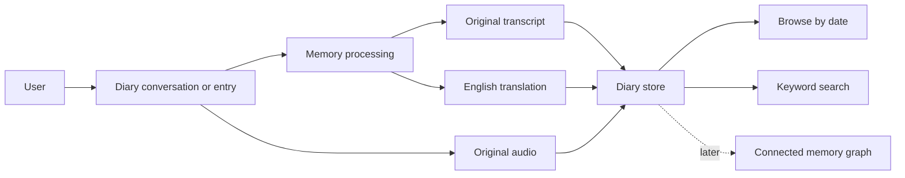

# AHAM — Personal Diary and Memory Canvas

AHAM is a personal diary system that can gradually grow into a useful memory companion. The experience should begin simply: speak or type, express what happened, keep the original, and return to it later.

> **Guiding thought:** Don't cheat your own brain. Stay true to yourself.

This GitBook is a living canvas, not a formal specification. It collects the current direction, architecture sketches, database thoughts, diagrams, questions, and future ideas in one place.

## The picture at a glance

## What this canvas contains

- [Vision](canvas/vision.md): what AHAM is trying to become.
- [Project map](canvas/project-map.md): the whole system on one page.
- [Current direction](canvas/current-direction.md): decisions clarified in the latest notebook pages.
- [Version 1](canvas/version-1.md): the agreed base project.
- [Feature map](canvas/feature-map.md): current and possible capabilities.
- [Architecture](canvas/architecture/system-overview.md): major parts and how they connect.
- [Database](canvas/database/overview.md): candidate entities and storage choices.
- [Later ideas](canvas/later-ideas.md): starred, boxed, and future notebook ideas.
- [Idea dump](canvas/idea-dump.md): useful thoughts that do not need a fixed place yet.
- [Things to think about](canvas/things-to-think-about.md): the remaining choices before and during database and API design.

## How this canvas changes

New notebook pages can be added gradually. Git keeps the detailed history while the website stays simple and easy to scan.

Nothing unclear from the notebook is silently treated as a final decision.
