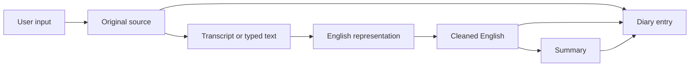

# AHAM

AHAM is a private, diary-first personal memory system. Its first responsibility is simple: help a person capture what they want to remember, preserve the original evidence, and make those memories easy to return to later.

> **Product principle:** Don't cheat your own brain. Stay true to yourself.

AHAM is developed incrementally. The early product is intentionally narrower than the long-term vision.

## Phase 1 — ADI

**ADI — Audio Diary Initiative** establishes the dependable diary foundation.

Phase 1 supports:

- audio recording and audio upload;
- typed diary input;
- original audio retention;
- original-language transcription;
- English translation when required;
- a faithful cleaned-English representation;
- an AI-generated summary and optional title;
- browsing entries by diary date;
- multiple entries on the same date;
- backdated entries;
- entries that refer to one or more historical date ranges;
- keyword search;
- immutable finalized diary content;
- soft deletion, restore, and 30-day purge;
- user accounts, email verification, authentication, and sessions;
- private attachment storage and processing foundations.

Phase 1 does **not** require conversational AI. Audio is captured as user input and processed after capture. Natural AI follow-up conversations belong to the next phase.

## Phase 2 — Memory and conversation

After the diary foundation is reliable, AHAM can expand into a more active personal memory system:

- conversational diary interactions;
- semantic/vector search;
- connected memories and knowledge graphs;
- evidence-backed user facts and relationships;
- people, places, events, goals, habits, and recurring themes;
- local/on-device processing and stronger privacy modes;
- deeper personal context and insights.

Phase 2 systems must reference stable Phase 1 source records rather than replace the original diary history.

## Core data principle

AHAM distinguishes between **source evidence** and **derived representations**.

The original audio/text is the source of truth. Cleaned text may improve grammar, remove filler, repair obvious transcription artifacts, and make mixed-language input readable, but it must not invent facts, emotions, dates, people, causes, or intentions.

## Current technical direction

- **Web:** React
- **Backend:** Java / Spring Boot
- **AI processing:** separate service where useful, likely Python
- **Primary database:** PostgreSQL
- **Object storage:** private S3-compatible/object storage; Cloudflare R2 is the current cloud direction, with local/self-hosted storage kept possible behind an abstraction
- **Initial scale target:** approximately 1,000 users

## Documentation map

- [Vision](canvas/vision.md)
- [Phase 1 — ADI](canvas/phase-1-adi.md)
- [System architecture](canvas/architecture/system-overview.md)
- [Audio and processing flow](canvas/architecture/audio-memory-flow.md)
- [Authentication and access](canvas/architecture/auth-and-access.md)
- [Database overview](canvas/database/overview.md)
- [Database entities](canvas/database/entities.md)
- [Storage](canvas/database/storage.md)
- [Phase 2 ideas](canvas/later-ideas.md)
- [Open engineering decisions](canvas/things-to-think-about.md)
- [Notebook archive](canvas/notebook-notes.md)

The notebook archive records the origin of ideas. The documents above are the current product and engineering specification.
