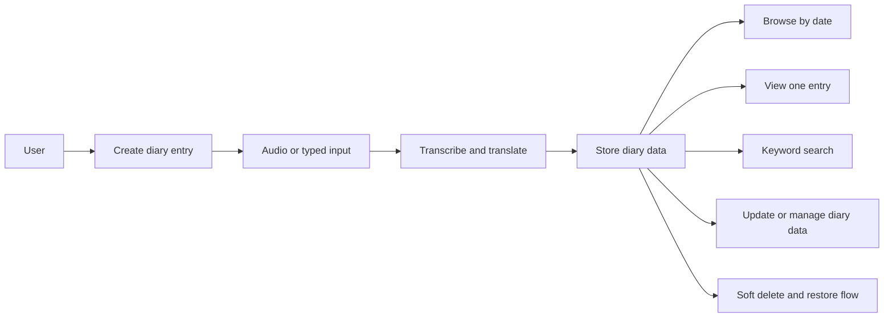
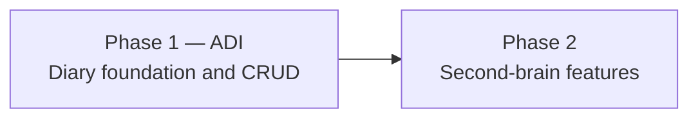

# AHAM — Personal Diary and Memory Canvas

AHAM is being built in phases.

## Current phase

**Phase 1 / Version 1: ADI — Audio Diary Initiative**

ADI is the diary foundation of the application. All development in this phase is focused on the diary experience and the core CRUD capabilities needed to support it.

Phase 2 will introduce the second-brain features such as semantic memory, knowledge graphs, connected memories, patterns, and deeper personal insights.

> **Guiding thought:** Don't cheat your own brain. Stay true to yourself.

This GitBook is a living canvas, not a formal specification. It keeps the current scope, architecture sketches, database thoughts, diagrams, questions, and future ideas in one place.

## ADI at a glance

## Phase boundary

## What this canvas contains

- [Vision](canvas/vision.md)
- [Project map](canvas/project-map.md)
- [Phase 1 — ADI](canvas/phase-1-adi.md)
- [Current direction](canvas/current-direction.md)
- [Version 1](canvas/version-1.md)
- [Feature map](canvas/feature-map.md)
- [Architecture](canvas/architecture/system-overview.md)
- [Database](canvas/database/overview.md)
- [Later ideas](canvas/later-ideas.md)
- [Things to think about](canvas/things-to-think-about.md)

New notebook pages can be added gradually. Git keeps the detailed history while the website stays simple and easy to scan.
