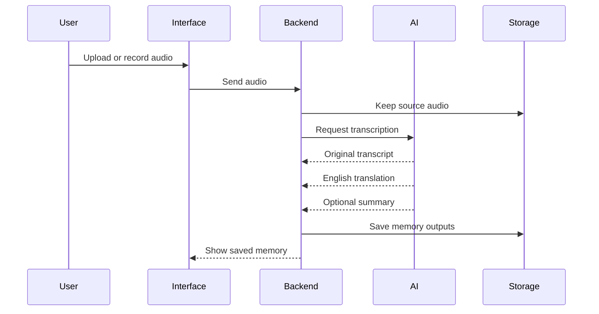

# Audio Memory Flow

## Inputs mentioned

- Audio files such as MP3 and WAV.
- Possible full-file upload.
- Possible chunks or streaming.

## Outputs mentioned

- Original transcript.
- English translation.
- Quick summary.
- Original audio.

## Still open

- Whether processing is synchronous or asynchronous.
- Whether streaming is needed at the beginning.
- Whether “two text files” means literal files or two stored text forms.
- Where audio files live.
- Which speech model or provider is used.
