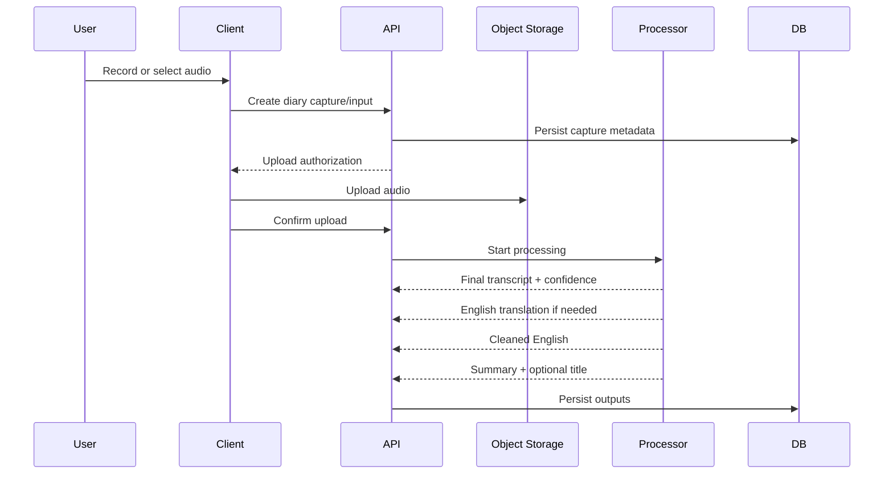

# Audio and Processing Flow

Phase 1 captures user input and produces durable diary representations. It does not require conversational AI.

## Capture flow

## Source preservation

The original audio is retained for the lifetime of the diary entry. Deleting the diary entry deletes the entire memory package through the soft-delete and purge lifecycle.

The database stores attachment metadata and provider-independent object references. Binary audio remains in private object storage.

## Transcript contract

Only the final transcript is stored as the normal durable transcript. Intermediate streaming/partial hypotheses are not part of the Phase 1 source-of-truth model.

Transcript data should preserve:

- original-language text;
- source/primary language;
- detected mixed-language metadata when useful;
- overall confidence when supplied by the provider;
- provider/model metadata for traceability.

If the source is already English, a duplicate English translation is unnecessary.

## English and cleaned representations

For non-English or mixed-language input, AHAM stores a faithful English translation.

The cleaned-English representation is a separate derived form. Its objective is to express what the user intended to communicate as clearly as possible while preserving meaning.

Allowed transformations include:

- grammar correction;
- filler removal;
- accidental repetition cleanup;
- sentence restructuring;
- obvious speech-to-text repair;
- natural English rendering of mixed-language speech.

Not allowed:

- adding facts not present in the source;
- guessing emotions or motivations as facts;
- inventing people, dates, places, events, causes, or intentions;
- silently resolving uncertainty in a way that changes meaning.

The original source remains available whenever derived text is questioned.

## Summary

The summary is intentionally lossy and is used for quick reading and later context selection. It must not replace the full cleaned representation as the canonical AI-readable form.

## Processing failure

Source preservation takes priority over derived processing.

If transcription or later AI processing fails:

- keep the original audio/input;
- preserve processing state and failure information;
- retry asynchronously where appropriate;
- do not lose the user's memory because a provider is unavailable.

A diary may be shown using the best completed representation available while remaining derived outputs finish later.

## Streaming direction

Continuous live AI conversation is not required for Phase 1. Initial implementation may use completed audio clips/uploads while keeping transport details outside the core data model.

Phase 2 may replace or extend the transport with streaming without changing ownership of diary sources and attachments.
