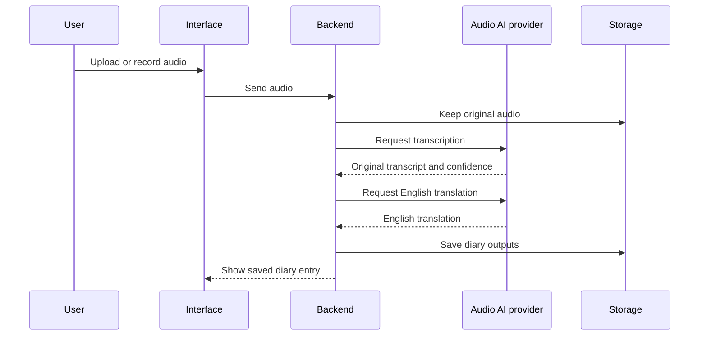
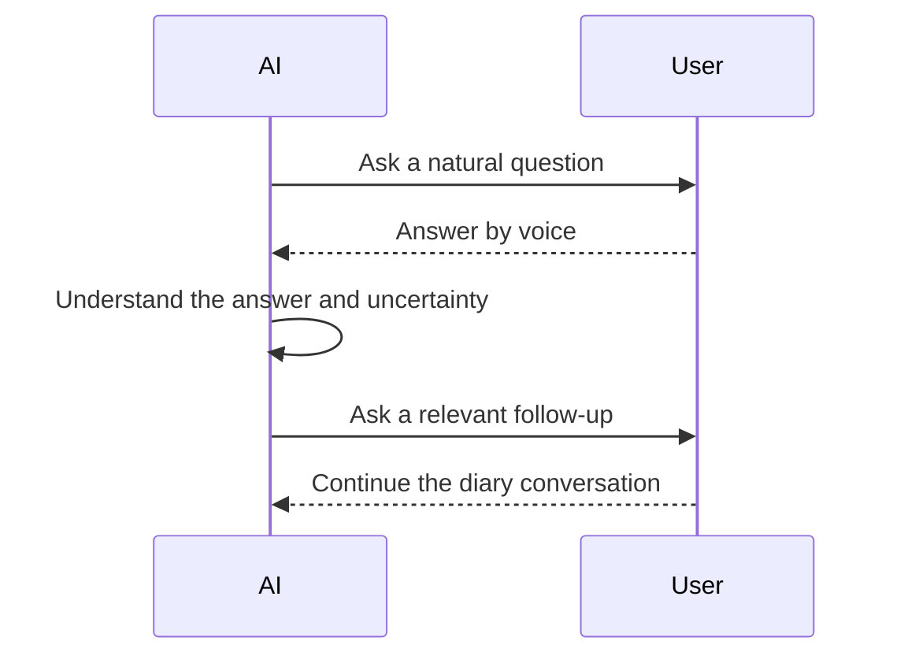

# Audio and Conversation Flow

The immediate product must accept audio. The larger goal is a conversational diary that feels natural rather than like a form.

## Version 1 processing flow

## Desired conversational direction

## Current AI direction

- Use a Google or other free API for audio processing when a suitable option is available.
- Prefer streaming where it supports the conversational experience.
- Move toward a local model in the future.
- Store or expose transcription confidence and other uncertainties.

## Still open for API design

- Does Version 1 send a completed recording as one upload, or stream live audio?
- If both are supported, which is built first?
- Is processing synchronous, asynchronous, or a mix?
- What are the maximum audio duration and file size?
- Which audio formats are accepted?
- What happens when the provider disconnects or returns a partial result?
- Where exactly is original audio stored?
