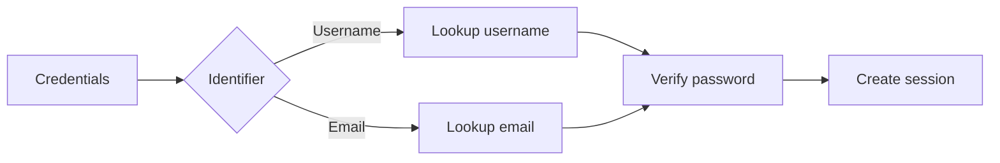

# Authentication and Access

Authentication is part of the Phase 1 foundation, even if the diary flow is implemented first.

## Registration

Phase 1 account creation requires:

- unique username;
- mandatory email address;
- password for local-credential accounts;
- email OTP verification.


## Login

Local accounts may authenticate with either:

- username + password;
- email + password.



## OAuth direction

Google and Apple sign-in are planned for the end of Phase 1.

OAuth identities are modeled separately from the core user row. An OAuth-created account:

- still has a unique AHAM username;
- must have an email when available/required by product policy;
- may have no local password;
- may link one or more external identity providers over time.

## User record

The Phase 1 user/account record should remain compact. Recommended core fields are:

- `id`;
- `username`;
- `email`;
- `password_hash` (nullable for OAuth-only accounts);
- `display_name`;
- `date_of_birth`;
- `timezone`;
- `preferred_language`;
- `locale`;
- `email_verified_at`;
- `status`;
- audit/deletion timestamps.

AHAM's long-term understanding of a person should not be represented by continually adding profile columns. Phase 2 may derive evidence-backed user facts from diary material with explicit source references.

## Sessions

A user may be signed in on multiple devices. Session records should support:

- session ID;
- user ID;
- refresh-token hash;
- expiry;
- revocation;
- device/user-agent metadata;
- IP metadata where useful;
- creation time.

Raw refresh tokens are not stored.

## Authorization rule

User-owned diary data must always be scoped by the authenticated user. Resource IDs alone are never sufficient authorization.

Conceptually:

```sql
SELECT ...
FROM diary_entries
WHERE id = :entry_id
  AND user_id = :authenticated_user_id;
```

The same ownership principle applies to captures, messages, attachments, transcripts, and deleted records.

## Privacy

Phase 1 uses server-side processing, so it must not be described as true end-to-end encryption. The immediate privacy baseline is:

- TLS in transit;
- private object storage;
- short-lived signed access URLs;
- encryption at rest;
- hashed passwords and refresh tokens;
- least-privilege service access;
- strict ownership checks;
- no permanent public attachment URLs.

A future local-only or true E2EE architecture requires dedicated device-key, recovery, and multi-device synchronization design.
