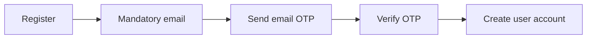
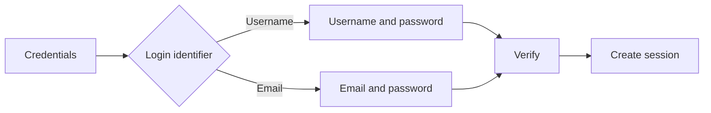

# Authentication and Access

The latest notes now define the base account flow more clearly.

## Registration

## Login

## Development order

The main diary functionality is built first. Login and registration are added afterward during Version 1 development.

## User information

Email is mandatory. The project also needs genuine user details to understand the person as diary data and the memory map grow.

Fields seen in the notebook include:

- username;
- first name;
- last name;
- email;
- password;
- age or date of birth;
- phone number;
- nickname;
- profile summary.

The exact required and optional fields still need to be selected before the user table and registration contract are finalized.

## Sessions

The earlier notebook sketches:

- session ID;
- user ID;
- refresh-token hash;
- expiry;
- device;
- IP address.

## Hosting and remote access

The preferred host is a friend's home system if practical; cloud is the fallback. The exact public access, TLS, networking, backup, and operational setup remains to be designed.
