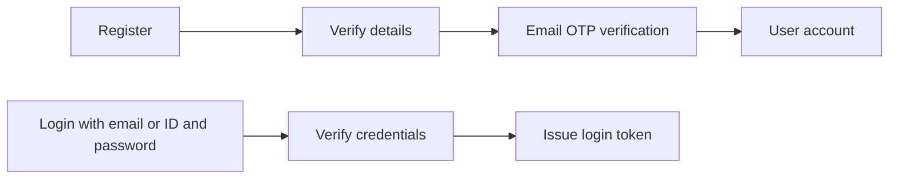

# Authentication and Access

Several authentication and remote-access possibilities appear in the notebook. They are kept as options rather than combined into a single invented design.

## Account flows mentioned

Other notes mention Gmail sign-in.

## Account information mentioned

- First name.
- Last name.
- Email.
- User ID or ID.
- Password.
- Name or username.
- Age.
- Phone number.
- Possible nickname, summary, and date of birth.

The required first-version fields are not fixed.

## Sessions

The notebook sketches:

- session ID;
- user ID;
- refresh-token hash;
- expiry;
- device;
- IP address.

## Remote access ideas

- Open SSH, with a note that internet exposure is risky.
- Tailscale.
- WireGuard.
- A home server or local deployment.

No remote-access option has been selected in the notebook.
