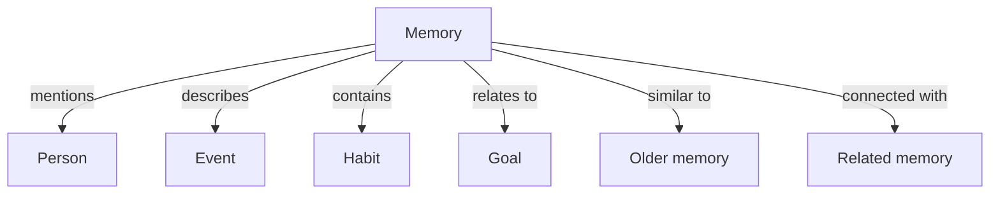
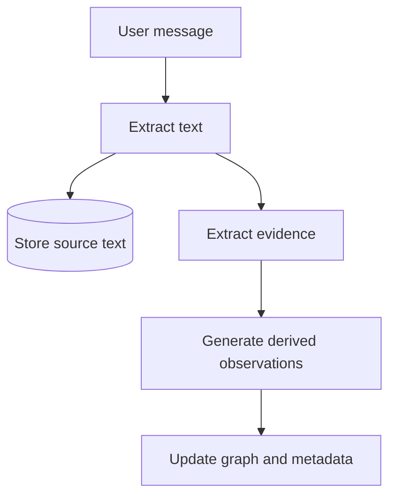

# Knowledge Graph and Memory Engine

The knowledge graph is a Phase 2 representation of the “second brain” idea.

## Repeated memories become stronger

The notebook proposes that events, people, or relationships mentioned again and again become more strongly connected. Core memories may therefore stay more prominent while less active memories become weaker over time.

This is an idea for a future memory engine, not a settled scoring algorithm.

## Possible memory variables

The latest notes mention future variables such as:

- importance;
- emotional relevance;
- memory decay;
- repeated activity or repeated mentions that strengthen a memory.

The notebook also raises the idea of reconstructing or visualizing the user's mental model at a particular period in time. The presentation method and mathematical model are still open.

## Evidence before graph changes

A useful future principle appears in the notes: derived importance and graph changes should be tied back to actual evidence rather than generated without traceability.

A future evidence record could preserve the source passage or transcript reference used to support a graph update. Exact tables, schemas, scoring, and approval rules remain undecided.

## Safer graph evolution

Existing notebook direction still applies:

1. detect entities or relationships;
2. attach confidence;
3. preserve supporting evidence;
4. review important changes through a human or rule when needed;
5. update the graph.

The graph should remain a derived model of source memories, not the only copy of the user's history.
