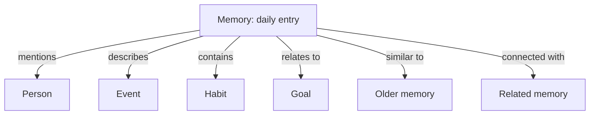

# Knowledge Graph

The knowledge graph is the visual form of the “second brain” idea.

## Notebook direction

The graph may begin with user text processed by an LLM. A later note adds more control:

1. Detect entities or relationships.
2. Attach confidence.
3. Review with a human or a rule.
4. Approve important changes.
5. Update the graph schema or graph.

This suggests a safer evolution than allowing every model output to rewrite the graph directly.

## What the graph may represent

- People.
- Places.
- Events.
- Habits.
- Goals.
- Topics.
- Links between memories.
- Strength created by repeated interactions or mentions.

The node types, relationship types, and scoring rules remain open.
