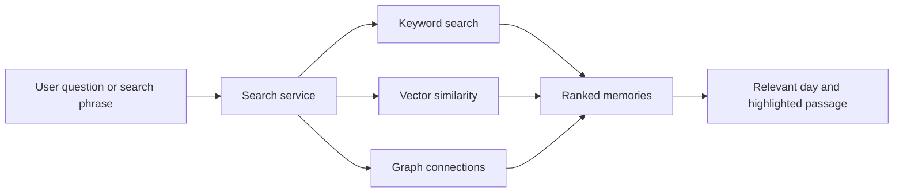

# Memory Search

Memory search is the step from keeping a diary to building a useful memory system.

## Search experiences in the notebook

- Search across all stored files or memories.
- Retrieve a related memory from any day.
- Return a set of transcripts for a calendar query.
- Open one full transcript.
- Highlight the paragraph most related to the search string.

## Search layers

The notebook supports the idea of combining:

- relational filters such as user and date;
- text or keyword matching;
- vector similarity for semantic memory;
- knowledge-graph connections.

The exact ranking method is not defined.
