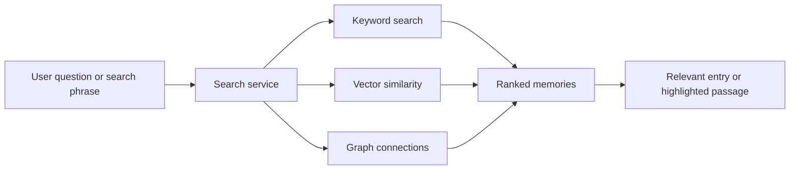
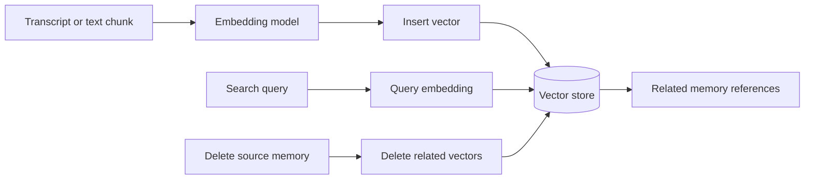

# Memory Search

Memory search is a Phase 2 step from keeping a diary to building a useful memory system.

## Search experiences in the notebook

- Search across stored memories.
- Retrieve a related memory from any day.
- Return transcripts for a calendar query.
- Open one full transcript.
- Highlight the paragraph most related to a search string.

## Future vector flow

The latest notebook adds the basic vector-store lifecycle:

Each stored vector needs metadata that can point back to the owning user and source transcript. The exact metadata schema and chunking rules are not fixed yet.

## Spaces — future idea

A later notebook idea proposes optional **spaces** for separating contexts inside one person's memory system. A user could keep a focused space for something like exam preparation, a project, or another important area instead of mixing every subject into one mental model.

This is a future organizational idea, not an ADI requirement. It still needs decisions about whether spaces are manual, AI-created, isolated search scopes, graph partitions, or simply labels.
