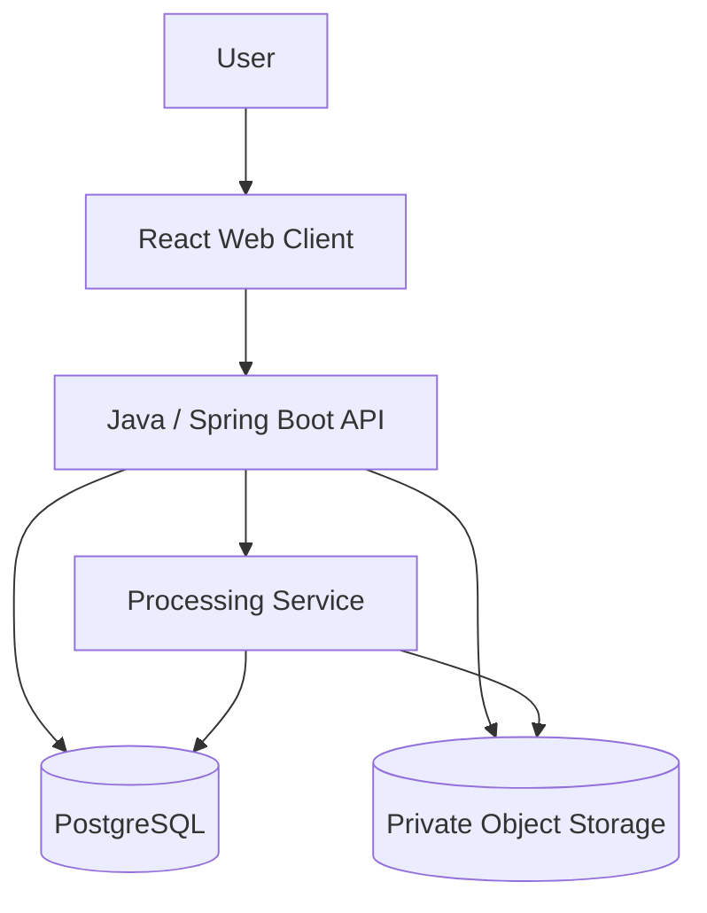
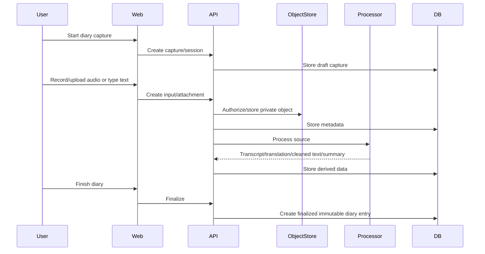

# System Overview

AHAM Phase 1 is designed as a small, dependable system with a clear separation between the user-facing application, structured data, object storage, and processing.

## Responsibilities

### Web client

- capture typed diary input;
- record or select audio;
- upload files through backend-issued upload targets where supported;
- show processing state;
- browse diary entries by date;
- view individual entries;
- search diary content;
- restore soft-deleted entries during the retention period.

### Java / Spring Boot API

The backend owns the Phase 1 domain model and authorization rules.

Responsibilities include:

- users, authentication, verification, and sessions;
- diary capture/session lifecycle;
- attachment metadata and storage authorization;
- transcription/processing orchestration;
- diary finalization;
- date organization;
- keyword-search API;
- soft deletion, restore, and purge coordination.

### Processing service

A separate service may be used for transcription, translation, cleanup, and summary generation. Python is the current likely implementation language for AI-related work.

The processing service must not become the owner of diary data. PostgreSQL remains the Phase 1 structured source of truth.

### PostgreSQL

Stores:

- user/account records;
- auth/session records;
- diary capture/session records;
- input/message records;
- attachment metadata;
- transcripts and translations;
- finalized diary entries;
- covered date ranges;
- processing state and job metadata;
- deletion lifecycle metadata.

### Object storage

Stores binary user content such as:

- original audio in Phase 1;
- images, video, documents, and other attachments later.

Objects are private. The database stores provider-independent object references rather than treating public URLs as permanent identifiers.

## Phase 1 processing model

## Phase 2 extension points

Phase 2 may add:

- conversational AI turns;
- semantic/vector search;
- knowledge graph;
- evidence-backed long-term user facts;
- local/on-device models and memory stores.

These systems should reference stable source IDs from Phase 1 rather than duplicate or replace the original diary history.
