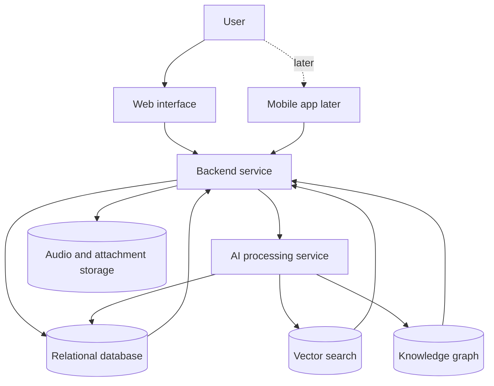

# System Overview

The notebook points to a system with a simple user experience and several storage or intelligence layers behind it.

## Current technical direction from the notes

- Front end: React is written as the web option.
- Mobile: Kotlin is written as a possible app direction.
- Backend: Java is the stated backend direction.
- AI work: a separate model or AI service is implied.
- Relational storage: PostgreSQL.
- Semantic retrieval: vector database or vector capability.
- Connected-memory model: graph database or knowledge graph.

## Important distinction

The notebook says all three database styles may be useful when their use cases are clear. It does not define whether they are separate products, extensions of one database, or a staged rollout.
