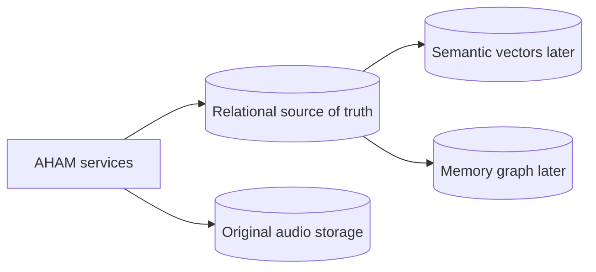
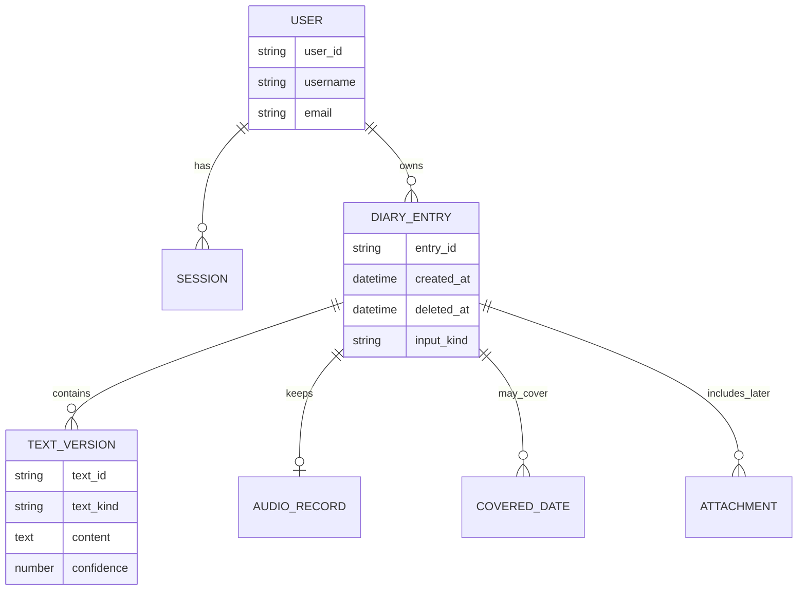

# Database Overview

The database canvas separates the original diary record from the later search and knowledge layers.

## Diary concept

The user-facing product should use a simple diary-oriented name. Internally, the database and API still need a stable resource name. `DIARY_ENTRY` is used in this canvas only as a working concept, not as a final table decision.

## Relational source of truth

Useful for:

- users and sessions;
- diary items and their dates;
- original transcript;
- English translation;
- processing status and confidence;
- soft deletion;
- references to original audio.

## English representation across layers

The latest note asks for English text to be available across the database or memory layers because it can support future ideas. Database design still needs to decide whether:

- PostgreSQL owns the canonical English text and other layers reference it;
- derived stores copy only the fragments they need;
- full English text is duplicated in each store.

No duplication strategy is assumed here.

## Visual entity map

`DIARY_ENTRY`, `TEXT_VERSION`, and `COVERED_DATE` are discussion concepts for the upcoming schema design. Their final names and shapes require confirmation.
