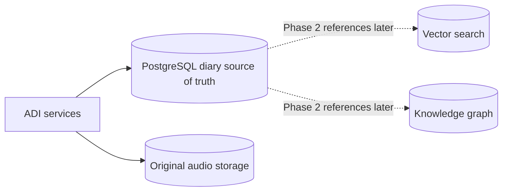
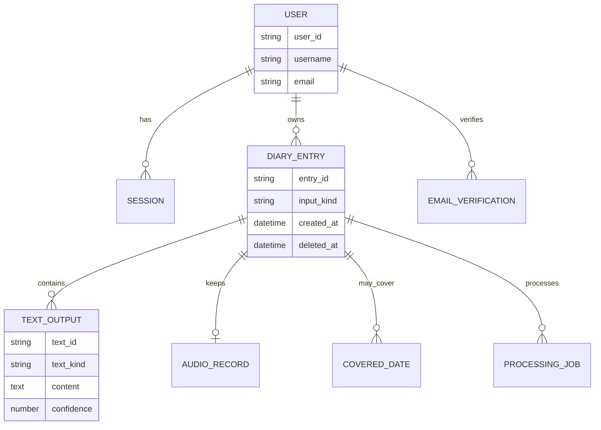

# Database Overview

The current database design is for **Phase 1: ADI — Audio Diary Initiative**.

Its job is to provide a reliable diary source of truth and the CRUD foundation of the application. Phase 2 vector and graph models should not drive the Phase 1 schema prematurely.

## Phase 1 data areas

- users and profiles;
- email verification;
- credentials and sessions;
- diary entries;
- diary dates and multi-day coverage;
- typed content;
- original transcripts;
- English translations;
- confidence information;
- original audio metadata and file references;
- processing jobs and failure states;
- keyword-search support;
- soft deletion and later purge.

## Working visual model

These names remain working concepts until the detailed schema is approved.

## Phase 2 boundary

Vector embeddings and graph entities may later reference stable Phase 1 diary IDs. They do not need to be implemented during ADI.
