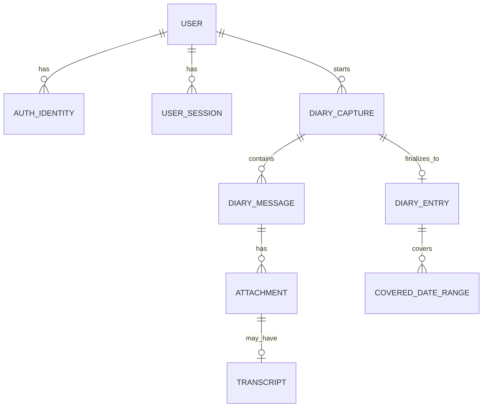

# Database Overview

PostgreSQL is the Phase 1 structured source of truth for AHAM.

The schema is designed around a simple rule: preserve the original diary evidence, keep the common read path fast, and leave clean extension points for Phase 2 without implementing Phase 2 prematurely.

## Core model



`DIARY_CAPTURE` is the pre-finalization session/draft. `DIARY_ENTRY` is the finalized user-facing diary record.

## Why capture and entry are separate

AHAM creates the final diary only after capture/processing is complete enough to finalize.

This allows:

- resumable drafts;
- multiple unfinished captures;
- audio upload and processing before finalization;
- typed and audio input to share the same lifecycle;
- a finalized diary entry to remain immutable from the user's perspective.

## Common read path

The user-facing `diary_entries` table should contain the fields needed for normal browse/view operations, including:

- owner ID;
- diary date;
- recorded timestamp and timezone;
- optional title;
- cleaned English text;
- summary;
- finalization/deletion timestamps.

Opening a normal diary entry should not require joining attachment and transcript tables unless the client requests source material such as original audio or transcript.

## Source evidence path

Raw/source material remains linked underneath the capture:

```text
Diary capture
  -> user input/message
      -> attachment
          -> transcript
```

This creates provenance for later derived-memory systems.

## Date model

AHAM stores three distinct time concepts:

1. `recorded_at`: exact instant capture started;
2. `diary_date`: calendar date under which the user wants the entry displayed;
3. covered date ranges: one or more dates/ranges discussed inside the entry.

There is **no uniqueness constraint on `(user_id, diary_date)`**. A user may create any number of entries on one day, or none for many days.

Covered dates are normalized into a child table because an entry may discuss non-contiguous dates or ranges.

## Text representations

Phase 1 distinguishes:

- original typed text or original-language transcript;
- English translation when required;
- cleaned English;
- summary;
- optional title.

The cleaned-English representation is the canonical readable form for downstream processing. The summary is not a substitute for the full cleaned content.

## Attachments

All binary user input is modeled through a generic attachment table. Phase 1 primarily uses audio, while the same model can support images, PDFs, video, and other file types later.

Object binaries live outside PostgreSQL. The database stores provider-independent storage metadata.

## Search

Phase 1 keyword search should index user-originated and final diary text, especially:

- cleaned English;
- summary;
- original text/transcript;
- English translation.

PostgreSQL full-text search is sufficient for the initial scale. Vector search remains Phase 2.

## Deletion lifecycle

Deleting a diary entry marks the entire memory package as deleted. The default restore window is 30 days. Permanent purge removes database records and associated object-storage content.

## Phase 2 compatibility

Future vectors, user facts, graph nodes, and relationships should reference stable Phase 1 IDs such as:

- user ID;
- diary entry ID;
- message ID;
- transcript ID.

They remain derived models and must not replace the Phase 1 source history.
