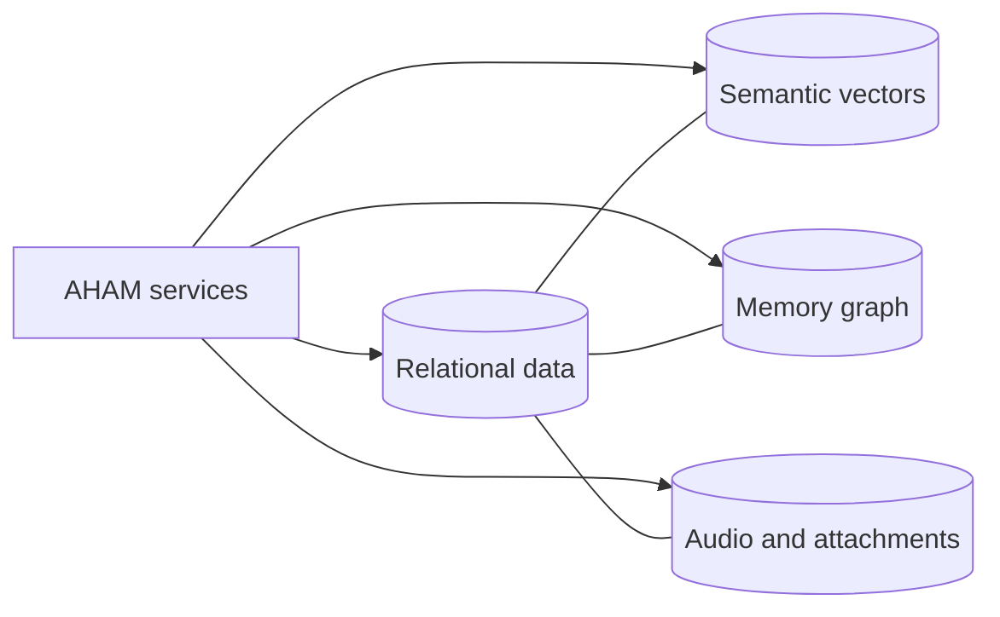
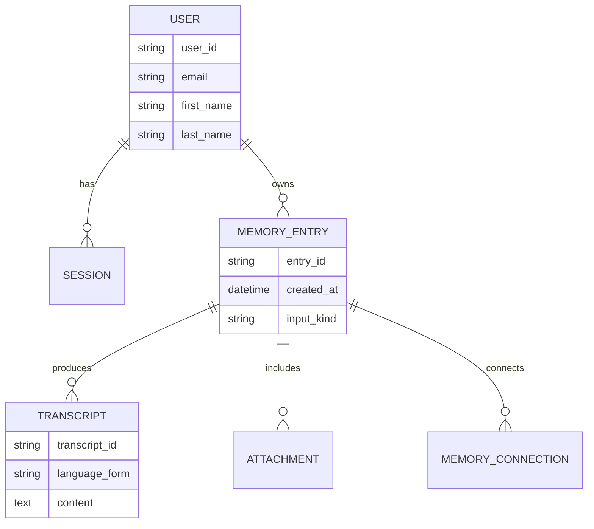

# Database Overview

The database canvas separates three different jobs rather than forcing everything into one model.

## Relational data

Useful for users, sessions, diary entries, timestamps, transcripts, and attachment metadata.

## Vector data

Useful for finding memories with similar meaning even when the exact words differ.

## Graph data

Useful for showing connections among people, events, habits, goals, and memories.

## File or object storage

Useful for source audio and future attachments.

## Visual entity map

`MEMORY_ENTRY` and `MEMORY_CONNECTION` are shown as helpful canvas concepts, not as notebook-confirmed table names. They make the diagram easier to discuss before a final schema exists.
