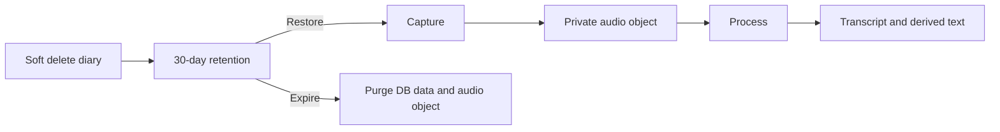

# Storage

AHAM keeps structured diary metadata in PostgreSQL and binary user content in private object storage.

## Storage abstraction

Application code should depend on a provider-neutral storage interface rather than Cloudflare-specific URLs or APIs.

Conceptually:

```text
ObjectStorage
  - createUploadTarget(...)
  - createDownloadTarget(...)
  - deleteObject(...)
  - verifyObject(...)
```

Possible implementations include:

- Cloudflare R2;
- local filesystem for development or controlled self-hosting;
- S3-compatible local/object storage;
- another cloud provider later.

The database stores durable object identity such as:

- storage provider;
- bucket/namespace;
- object key;
- content type;
- size and relevant metadata.

A public URL is not the permanent object identifier.

## Privacy model

Diary attachments are private by default.

Clients receive temporary authorized access rather than permanent public object URLs. Ownership must be checked before download authorization is issued.

The Phase 1 privacy baseline includes:

- TLS in transit;
- encryption at rest;
- private buckets/objects;
- short-lived signed access;
- strict service permissions;
- deletion of objects when the associated diary memory is permanently purged.

## Audio lifecycle

Phase 1 retains original audio for the lifetime of the diary memory.



Individual audio deletion while preserving the diary is not part of the initial product contract.

## Upload lifecycle

An attachment may have a database record before the binary upload is complete. Storage state should therefore distinguish states such as pending, uploaded/ready, failed, and deleted.

Abandoned uploads should be eligible for cleanup.

## Future attachment types

The same attachment model is intended to support:

- images;
- PDFs and documents;
- video;
- other binary diary context.

Media-specific metadata belongs in normal columns when frequently queried and in structured metadata/JSON when it is type-specific and optional.

## Local-only future direction

A later AHAM mode may keep memories, embeddings, and models entirely on the user's device. This is separate from the Phase 1 server storage model.

Local-only privacy introduces different trade-offs for backup, device loss, and multi-device synchronization. The Phase 1 schema should preserve clean identifiers and exportable source records but should not pretend that these future cryptographic/synchronization decisions are already solved.
