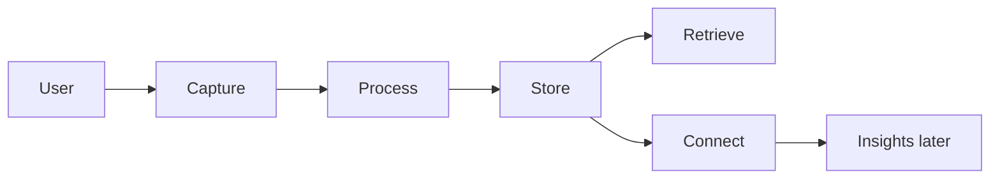
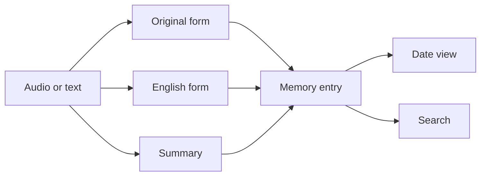
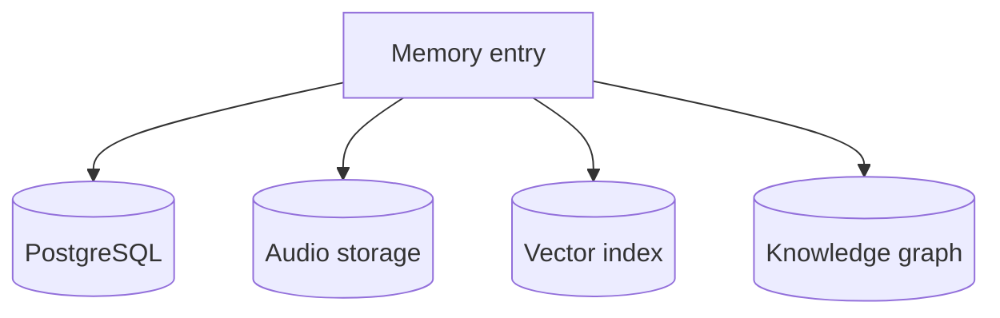
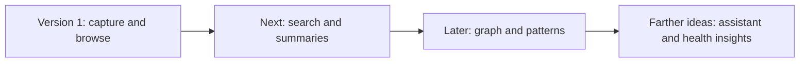

# Diagrams

This page collects the key visual views in one place.

## Whole system

## Memory pipeline

## Storage map

## Incremental view

The detailed versions of these diagrams live in the architecture and database pages.
