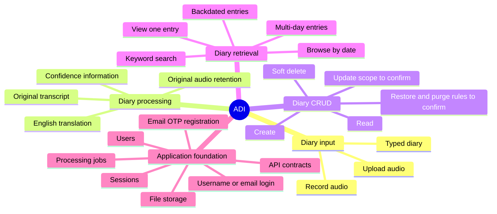

# Phase 1 — ADI

**ADI** stands for **Audio Diary Initiative**.

This is Phase 1 and Version 1 of AHAM. The goal is to build a complete and dependable diary foundation before adding second-brain capabilities.

## Phase objective

Create the core application ground:

- diary creation;
- diary viewing;
- diary updating where the exact editable fields are approved;
- diary deletion through soft delete;
- diary listing and date browsing;
- audio handling;
- transcription and English translation;
- keyword search;
- user accounts and authentication;
- the database and API foundations needed by the diary product.

## What belongs to ADI

## What does not belong to ADI

These are Phase 2 concerns:

- semantic or vector memory search;
- knowledge graph;
- connected memories;
- people, event, place, habit, and goal graphs;
- mood and habit patterns;
- personal dashboards;
- proactive second-brain reminders;
- deeper personal insights;
- health or mental-health analysis.

The database may preserve clean references that make Phase 2 possible later, but Phase 1 should not build Phase 2 features early.

## Success of Phase 1

ADI is successful when a public user can reliably create, find, view, manage, and safely retain diary entries with their audio and text representations.

## One remaining CRUD clarification

Earlier notes said editing is disabled for now, while the latest clarification says Phase 1 includes all CRUD foundations. Before the update API is finalized, confirm whether Phase 1 update means:

- editing diary metadata only;
- editing typed diary text;
- editing generated transcript or translation;
- replacing audio;
- or reserving update capability internally while keeping the first UI read-only.

No choice is assumed here.
