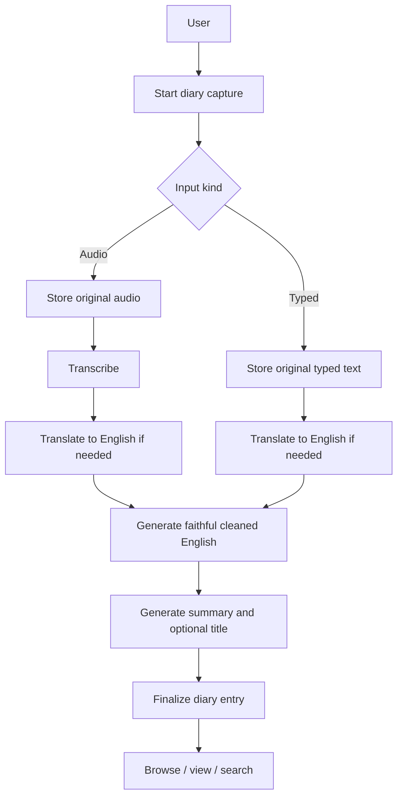

# Phase 1 — ADI

**ADI — Audio Diary Initiative** is Phase 1 of AHAM. Its goal is to establish a reliable diary source of truth and the application foundations needed to operate it safely.

## Scope

ADI supports two user input paths:

1. recorded or uploaded audio;
2. typed diary text.

Both paths converge into the same diary model.

## Phase 1 capabilities

### Capture

- record audio;
- upload audio;
- enter typed text;
- preserve original user input;
- support resumable draft capture sessions;
- allow multiple unfinished captures when needed.

### Processing

For audio input:

- preserve the original audio object;
- store the final original-language transcript;
- store overall transcription confidence when available;
- create an English translation when the source is not English;
- create a faithful cleaned-English representation;
- create a concise summary;
- optionally generate a title.

For typed input, the same derived-text pipeline applies without transcription.

### Cleaned-English contract

`cleaned_english_text` is the canonical readable representation for Phase 1 processing and later AI use. It may:

- correct grammar;
- remove filler words and accidental repetition;
- repair obvious transcription artifacts;
- turn mixed-language input into natural English;
- improve sentence structure and readability.

It must **not** invent or infer unsupported facts, emotions, people, dates, causes, intentions, or events.

The original transcript or typed text remains the evidence source.

### Diary organization

A diary entry has separate concepts for:

- when the capture started (`recorded_at`);
- the diary/calendar date under which the entry is shown (`diary_date`);
- the timezone in effect when capture started;
- one or more date ranges discussed by the user.

Multiple diary entries may share the same `diary_date`. AHAM must not imply that one entry is required per day.

Backdated entries are supported by allowing the user to select an earlier `diary_date` during creation.

Covered dates are stored independently because one entry may discuss several non-contiguous dates or ranges.

### Retrieval

- browse by diary date;
- view an individual finalized entry;
- keyword search across user-originated and final diary representations;
- support multiple entries per day.

Search should prioritize:

- cleaned English;
- summary;
- original user text/transcript;
- English translation.

AI-generated prompts/questions should not be treated as user memory content for search.

### Finalization and immutability

A capture session exists before the final diary entry. Finalization occurs through a combination of explicit user action and application flow; the user remains in control of when the diary is considered complete.

After finalization, Phase 1 does not expose diary-content editing. This reflects the product principle of preserving what the user originally expressed rather than rewriting history later.

System-managed fields may still change for processing, storage, deletion, or recovery operations.

### Deletion

Deleting a diary entry deletes the memory as a unit:

- diary entry;
- underlying capture/session data;
- messages or inputs;
- attachments;
- original audio;
- transcripts and translations;
- derived text and summary.

Deletion is soft for 30 days. During that period the memory may be restored. After the retention period, a purge removes relational records and associated stored objects.

## Authentication foundation

Phase 1 includes:

- mandatory email;
- unique username;
- email OTP verification for registration;
- username/password or email/password login;
- sessions and refresh-token handling;
- Google/Apple identity support planned by the end of Phase 1;
- OAuth-created accounts may exist without a local password.

Authentication may be implemented after the first diary flow, but the database model must support it from the beginning.

## Explicitly outside Phase 1

The following belong to Phase 2 or later:

- conversational AI follow-up questions;
- real-time AI voice responses;
- semantic/vector search;
- knowledge graph and connected-memory engine;
- extracted long-term user facts and relationships;
- mood/habit pattern analysis;
- on-device-only memory mode;
- local embeddings and private local memory graph;
- advanced end-to-end encrypted multi-device synchronization.

Phase 1 should preserve stable source IDs so these systems can reference original diary evidence later.
