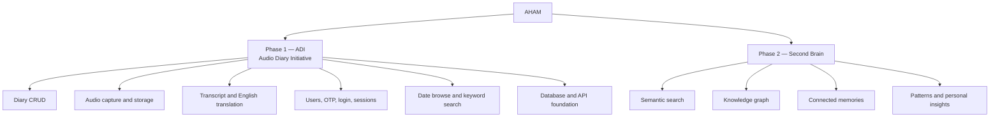

# Project Map

AHAM is divided into two clear phases.

## Phase 1 — ADI

The current project work is limited to the diary domain:

- audio upload or recording;
- typed diary;
- diary CRUD foundation;
- original transcript;
- English translation;
- original audio retention;
- date browsing;
- keyword search;
- backdated and multi-day entries;
- users, authentication, and sessions;
- soft delete;
- storage, database, and API foundations.

## Phase 2 — Second brain

Phase 2 will use the diary foundation to build:

- semantic memory search;
- knowledge graph;
- connected memories;
- extracted entities and events;
- mood, habit, goal, and time-use patterns;
- dashboards and proactive assistance.

## Boundary rule

Phase 1 may store stable IDs and clean data that Phase 2 can reference later. It should not implement Phase 2 behavior prematurely.
