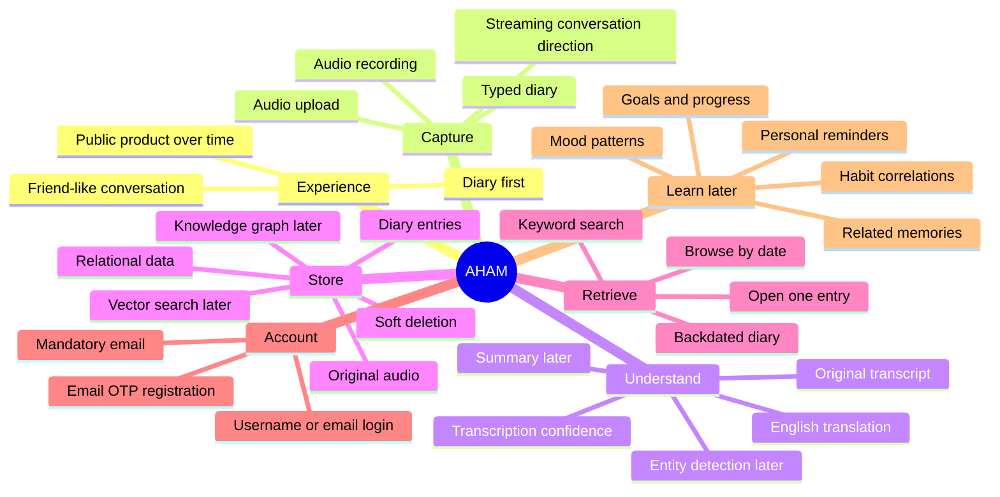

# Project Map

This page shows the project as a canvas rather than a task tracker.

## Current direction

- Version 1 is the public product's base, built incrementally.
- The visible concept is a diary rather than a “memory entry.”
- Audio upload or recording and typed diary are part of Version 1.
- Original transcript, English translation, and original audio are retained.
- Entries can be browsed by date and searched by keyword.
- Entries can be created for earlier dates and may cover multiple days.
- Editing is disabled initially.
- Deletion is soft deletion.
- Authentication is added after the main diary flow during Version 1 development.
- Conversational follow-up and streaming are the intended direction, but their exact Version 1 boundary remains open.

## Still fluid

- Final user-facing name for one diary item.
- Upload-after-recording versus live streaming in Version 1.
- Synchronous versus background processing.
- Exact user profile fields.
- Exact multi-day date representation.
- Canonical storage of original and English text across relational, vector, and graph layers.
- Home hosting feasibility and cloud fallback details.
