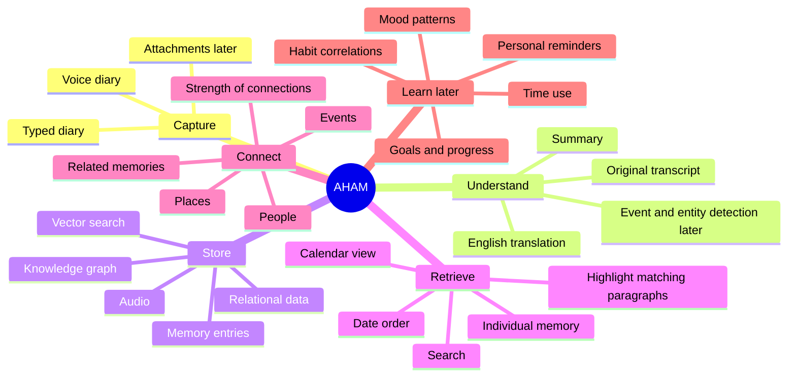

# Project Map

This page shows the project as a canvas rather than a task tracker.

## Current direction

- A user account and profile.
- Voice diary as the main input.
- Typed diary as another possible input.
- Original audio retained.
- Original-language transcript and English translation.
- Date-ordered browsing.
- Search across memories.
- A relational database, vector search, and a knowledge graph may work together.

## What is still fluid

Authentication method, audio processing mode, exact database shape, model provider, hosting setup, and the first knowledge-graph update flow are not fixed in the notebook.
