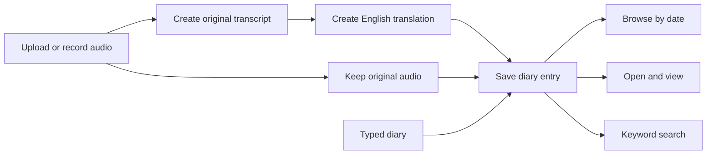

# Version 1

Version 1 is the base public product setup. It will be built incrementally rather than attempting the complete second-brain vision at once.

## User experience

## Version 1 promise

- Audio upload or recording.
- Typed diary.
- Original transcript.
- English translation.
- Original audio retention.
- Browse entries by date.
- Open and view one entry.
- Keyword search.

## Current limits

- Editing is disabled.
- Open-and-edit may be added later if required.
- Deletion uses soft delete rather than immediate permanent removal.
- Summary generation is not currently listed as part of the agreed Version 1 promise.
- Semantic search and the knowledge graph remain later stages.

## Build sequence

The main diary functionality comes first. Registration and login are built afterward within the Version 1 development cycle.

Before the product is public, the account flow should support:

- mandatory email;
- OTP verification during registration;
- login using username and password or email and password.

## Conversation direction

The desired end experience is a natural voice conversation where the AI asks relevant follow-up questions. Streaming is a strong direction for that experience, but it is not yet confirmed whether the first Version 1 implementation must be live streaming or can begin with recorded audio upload.

## Hosting

Prefer hosting on a friend's home system if it is practical and reliable. Use cloud hosting otherwise.
