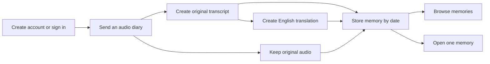

# Version 1

The notebook describes a small first version before the larger second-brain vision.

## Core experience

## A reasonable first canvas

These items are clearly present in the notebook as the base direction:

- User registration and login.
- User profile details.
- Audio input such as MP3 or WAV.
- Transcription of Telugu, English, or mixed speech.
- English translation.
- Storage of original audio and text outputs.
- Date-based ordering.
- Viewing stored memories.
- Retrieving an individual memory.

## Near the edge of Version 1

The notebook mentions these, but their placement is not fully clear:

- Quick summaries.
- Memory search.
- Email OTP.
- Gmail sign-in.
- Typed diary.
- Asynchronous or streaming audio processing.

They are kept visible without forcing them into the first build.
