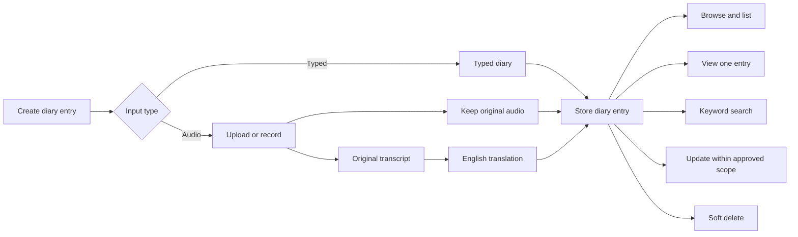

# Version 1 — ADI

Version 1 is **Phase 1: ADI — Audio Diary Initiative**.

Its purpose is to build the complete diary foundation of AHAM. Phase 2 second-brain features are intentionally outside this version.

## ADI flow

## Version 1 scope

### Diary CRUD foundation

- Create audio or typed diary entries.
- Read lists and individual entries.
- Update diary data within a boundary that still needs confirmation.
- Soft delete entries.
- Define restore and permanent-purge behavior.

### Diary processing

- Upload or record audio.
- Store original audio.
- Store original transcript.
- Store English translation.
- Preserve confidence or uncertainty information.

### Diary retrieval

- Browse by date.
- Add entries for earlier dates.
- Support entries covering multiple days.
- Open and view one entry.
- Keyword search.

### Application foundation

- Users and profiles.
- Email OTP registration.
- Username/email and password login.
- Sessions.
- Processing jobs and failure handling.
- File storage.
- Database design.
- API contracts.

## Explicitly Phase 2

- Vector or semantic search.
- Knowledge graph.
- Connected-memory graph.
- Mood and habit pattern analysis.
- Personal dashboards and second-brain insights.

## Current conflict to resolve

Earlier clarification disabled editing, while the latest Phase 1 statement includes all CRUD foundations. The exact update behavior must be confirmed rather than guessed.
